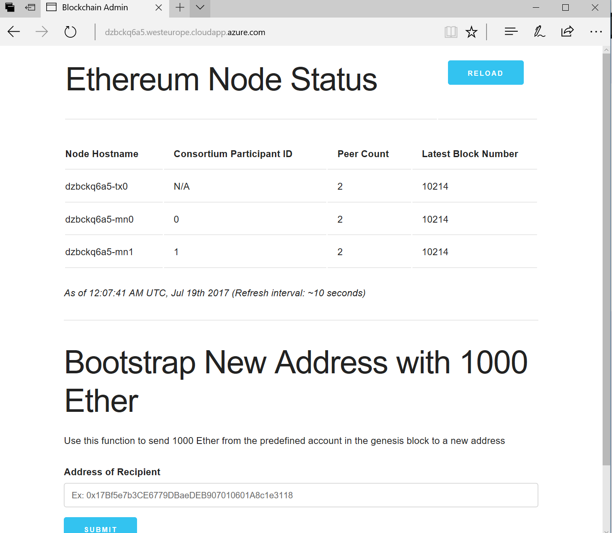
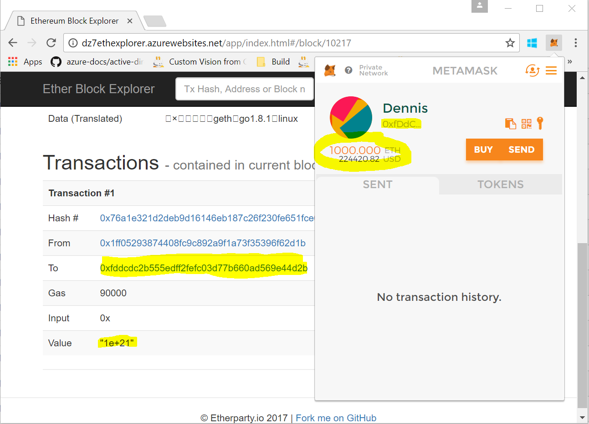

# Prepare your blank azure vm for development
The following setup is designed to work with a blank Windows Server 2016 virtual machine that you can provision from an Azure Dev Test Lab.

## Install required tools
1. Open Internet Explorer (does not work on Chrome) and paste the following URL: 

http://boxstarter.org/package/nr/url?https://raw.githubusercontent.com/denniszielke/hackbotsimple/master/scboxstarter.txt

2. Click Run on the security warning. 
3. Click Run again when prompted. 
4. This will take about 5 minutes and does the setup of prerequired software: Visual Studio Code, NodeJs, Git, Google Chrome, Fiddler4

## Install and configure Mist
1. Download the latest [Mist](https://github.com/ethereum/mist) [release](https://github.com/ethereum/mist/releases) for your machine and unpack it to a folder.
2. Open the folder and create a shortcut for the mist.exe
3. Edit the shortcut and add your rpc endpoint as a startup command for mist
~~~
--rpc http://default.westeurope.cloudapp.azure.com:8545  
~~~

Since Mist 0.91 you can speed up the launch of Mist by using the following additional command line parameter
~~~
--light-node
~~~

You also want to add the following additional parameter to disable swarm
~~~
--swarmurl "null"
~~~
4. Launch mist it will connect to your environment

You should  see a warning because we have not set up SSL - which is ok so ignore it: 

5. It will take a while for the app to sync

6. Once you are connected you sheed see a little red button on the left that signals to you that you are connected to a private-net:

## Install and configure Metamask
1. Open Chrome and go to [https://metamask.io/](https://metamask.io/) to install the Metamask chrome plugin
2. Once metamask is installed and you have created an account, launch it and configure a custom RPC endpoint with your rpc endpoint from your Azure environment.

3. Unfortunately your wallet is by default empty - has 0 Ether. Copy your wallet adress and lets change that.

4. Go to the url of your Admin site (check output of the Ethereum arm template output), enter your wallet adress and transfer 1000 ether to it.

5. Go to the explorer to check the transaction

## Install and launch testrpc
TestRPC will simulate a local ethereum blockchain - it mostly will behave like ethereum which facilitates local dev/ testing and should speed up you development cycle.

1. Install testrpc by launching a cmd and running the following command as an admin
~~~
npm install -g ethereumjs-testrpc
~~~
2. If you run the following command you will get your own localhost rpc endpoint which you can use for the demo apps and apis
~~~
testrpc
~~~
