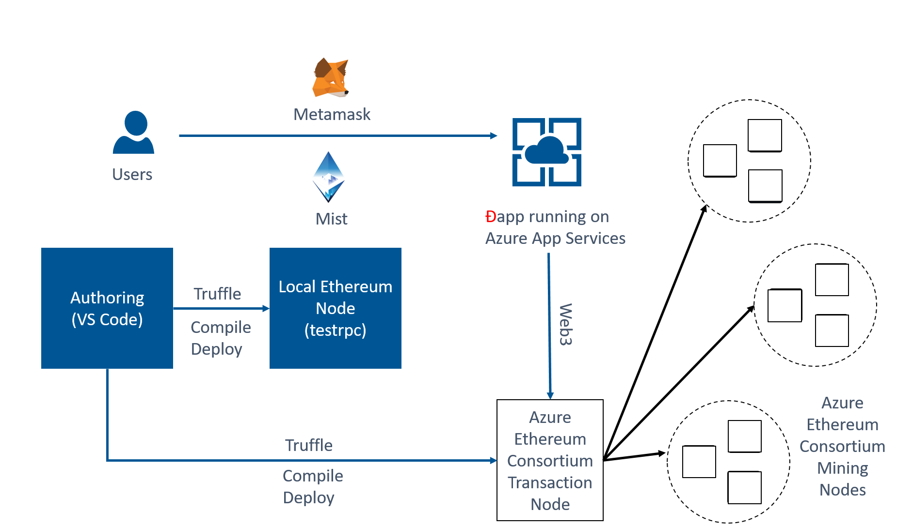

# Ethereum Hackathon Lab
This project describes how to set up a blockchain environment with samples to run a Ethereum Hackathon using the Azure Blockchain as a Service, Tools and Architecture.

## Setting up the Hackathon environment
You will need to perform the following steps to get your environment up and configured:
1. [Deployment and configuration of Azure Ethereum Consortium Blockchain](EnvironmentSetup.md)
2. [Deployment of Ethereum Explorer Web App](ExplorerSetup.md)
3. [Deployment of a developer vm (this is where we will write and test smart contract code](DeveloperSetup.md)
4. [Development and Deployment of a Smart contract using Truffle](DevSmartContract.md)
5. [Development of a DApp](Dapp.md)

